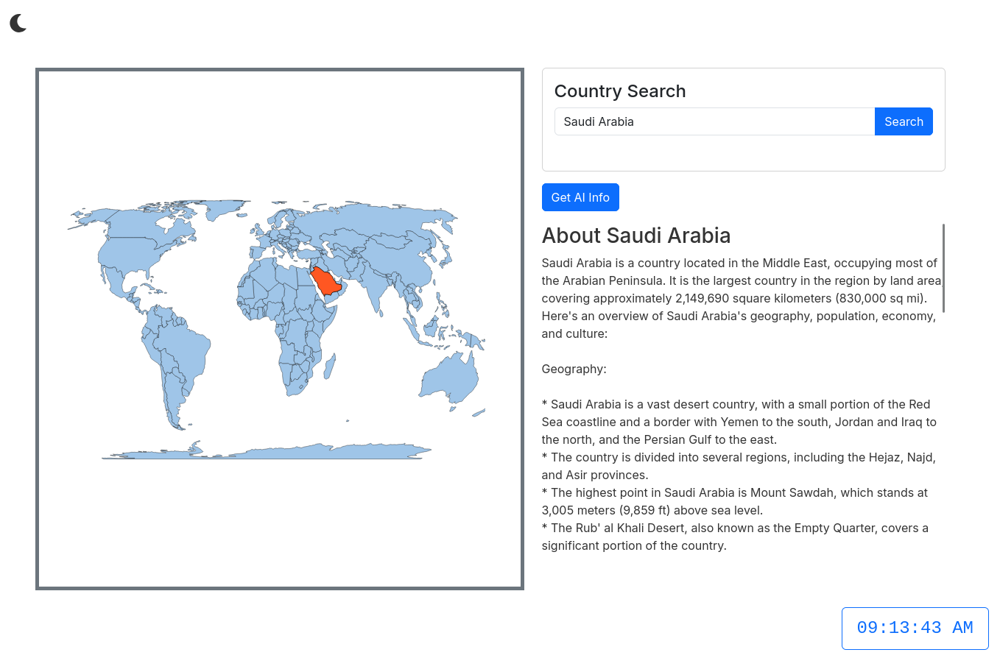

# 🌍 Country Finder AI App

A powerful and interactive web application that allows users to search for countries, view real-time maps, and receive detailed information using AI. Built with React, Axios, react-simple-maps, and Groq API.

---

## 🔍 Features

- 🔎 **Country Search**: Type to search any country by name.
- 🗺️ **Interactive Map**: View the selected country on a dynamic map using [React Leaflet](w).
- 📄 **Detailed Info**: Get live data like capital, population, region, etc.
- 🤖 **AI-Powered Insights**: Use [Groq API](w) to generate insightful descriptions and historical context about the country.
- 🌓 **Responsive UI**: Fully responsive and user-friendly design.

---

## 🛠️ Tech Stack

- ⚛️ [React](w) (Vite)
- 🌐 [Axios](w)
- 🗺️ [react-simple-maps](w)
- 🤖 [Groq LLM API](w)
- 🎨 [Material UI](w)

---

## 🚀 Live Demo

[Demo-Link](https://country-finder-swart.vercel.app/)

---

## 📷 Screenshots

### 🔍 WEB & Result

